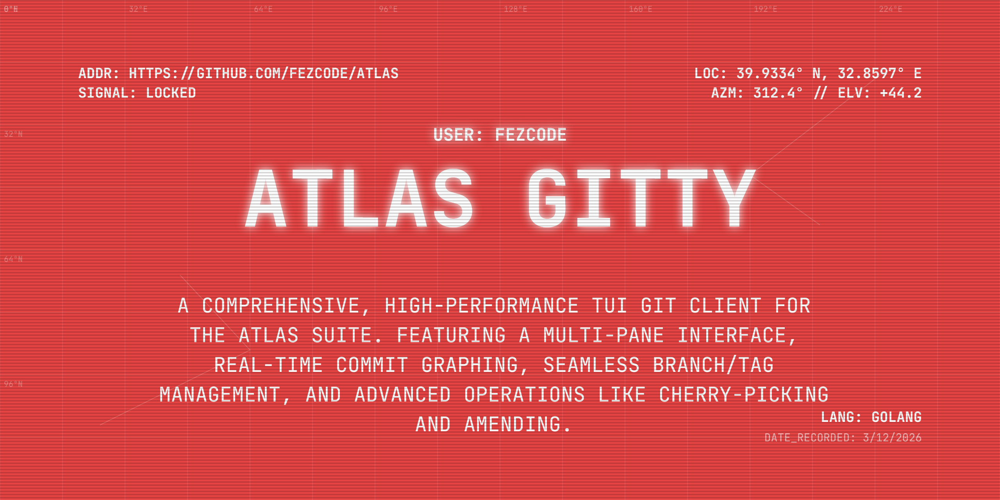

# atlas.git



A comprehensive TUI git client designed for power users who prefer the terminal but want the full features of modern GUI clients like GitHub Desktop and Fork.

#  Features

- **Git Graph**: Visual git log with branch visualization.
- **Branch Management**: Create, delete, switch, merge, and rebase branches.
- **Tag Management**: Full control over local and remote tags.
- **Diff Viewer**: Integrated syntax-highlighted diffs.
- **Multi-Repo Management**: Seamlessly switch between multiple git repositories.
- **Remote Management**: Manage origins, upstreams, and other remotes.
- **Everything GitHub Desktop/Fork does**: Stashing, cherry-picking, reverting, and more.

## Installation
Build using `gobake`:
```bash
gobake build
```
## Usage
```bash
./atlas.git
```
### Options
- `-v`, `--version`: Show version information.
## License

MIT